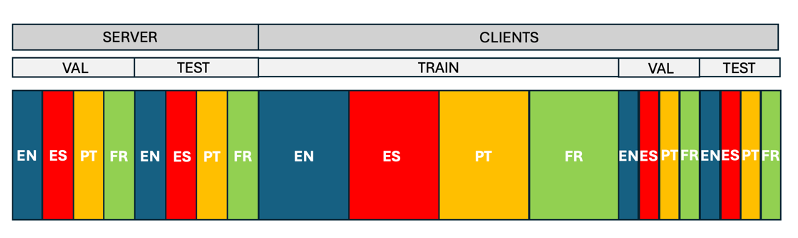

# FedEloquence (ICASSP submission)

## Overview

This branch contains the experimental code and configurations for our paper: **"CLIENT-DRIVEN CONVERGENCE IN FEDERATED LEARNING OF MULTILINGUAL LARGE LANGUAGE MODELS"**.

Our contributions extend the FederatedScope repository to support **multilingual federated fine-tuning of Large Language Models (LLMs)**.

> **Note:** For general installation and setup instructions of the repository, please refer to the **README_setup**.

---

## Key Features

### 🌍 Multilingual Fine-tuning Support

- **Flexible prompt integration** – Easily add new prompts for different languages
- **Language-aware processing** – Sample-wise preprocessing and fine-tuning based on language tags
- **Comprehensive data pipeline** – Tools for creating multilingual FL partitions including:
  - Server-side validation and test sets
  - Client-side train, validation and test sets
- **Evaluation metrics** – Built-in scripts for computing **BERTScore** and **ROUGE**

### 🎯 Local Dynamic Early Stop for Federated Learning (LDES-FL)

Our novel early stopping mechanism that allows clients to dynamically pause and resume training.

**Configuration:**

Set `federate.use_LDES` to `true` and `federate.use_global_early_stop` to `false` in your config file to enable LDES strategy. To use the default early stop method from the original repository, set these variables in the opposite way (`federate.use_LDES` to `false` and `federate.use_global_early_stop` to `true`). Additionally, make sure to specify the patience parameter using `early_stop.patience`.

### 📊 FedValLoss Aggregation Method

A validation loss-based aggregation strategy for improved convergence.

**Configuration:**

Set `federate.method` to `FedValLoss` in your configuration.

### ✨ Additional Improvements

- Flexible evaluation options against server and/or client test/validation sets
- Enhanced logging and monitoring capabilities
- Optimized data loading for multilingual scenarios

---

## Running Experiments

### Prerequisites

Ensure you have:
- Activated your virtual environment
- Configured the `ds_config` file with appropriate training parameters for your hardware (gradient_accumulation_steps, train_micro_batch_size_per_gpu and train_batch_size)

### Configuration Files

All experimental configurations used in the paper are located in `configs/multilingual/alpaca_cleaned/8c/salamandra-2b-instruct/`:

#### Early Stop Experiments
- `early_stop/ds_8c_5000r_30ls_r16_a32_1pat_160lts_fedavg.yaml`
- `early_stop/ds_8c_5000r_30ls_r16_a32_1pat_160lts_fedprox.yaml`
- `early_stop/ds_8c_5000r_30ls_r16_a32_1pat_160lts_fedvalloss.yaml`

#### Global (Language-Specific) Experiments
- `global/ds_8c_5000r_r16_a32_3pat_1eval_3b_16320lts_CA.yaml` (Catalan)
- `global/ds_8c_5000r_r16_a32_3pat_1eval_3b_16320lts_DA.yaml` (Danish)
- `global/ds_8c_5000r_r16_a32_3pat_1eval_3b_16320lts_DE.yaml` (German)
- `global/ds_8c_5000r_r16_a32_3pat_1eval_3b_16320lts_EN.yaml` (English)
- `global/ds_8c_5000r_r16_a32_3pat_1eval_3b_16320lts_ES.yaml` (Spanish)
- `global/ds_8c_5000r_r16_a32_3pat_1eval_3b_16320lts_EU.yaml` (Basque)
- `global/ds_8c_5000r_r16_a32_3pat_1eval_3b_16320lts_HR.yaml` (Croatian)
- `global/ds_8c_5000r_r16_a32_3pat_1eval_3b_16320lts_SR.yaml` (Serbian)

### Execution

Run the following command, replacing the config path with your desired experiment configuration:

    deepspeed federatedscope/main.py --cfg configs/multilingual/alpaca_cleaned/8c/salamandra-2b-instruct/early_stop/ds_8c_5000r_30ls_r16_a32_1pat_160lts_fedavg.yaml

Make sure the directory specified by `federate.adapt_save_to`, where the trained adapter will be stored, exists before running the command.

### Evaluation - Computing BERTScore and ROUGE Metrics

Once you have a trained adapter, evaluate it using the following scripts:

**Available Evaluation Scripts:**
- `eval_server_testset_rouge_and_bertscore_metrics.py` - Server test set
- `eval_server_valset_rouge_and_bertscore_metrics.py` - Server validation set
- `eval_clients_testset_rouge_and_bertscore_metrics.py` - Clients test set
- `eval_clients_valset_rouge_and_bertscore_metrics.py` - Clients validation set

The trained adapter must be stored in the path specified by `federate.adapt_save_to` in your config file.

**Usage:**

Use `--model_to_eval` to specify which model to evaluate:
- `final` - Evaluate the final aggregated model
- `client_X` - Evaluate a specific client model (e.g., `client_1`, `client_2`)

**Example:**

    python federatedscope/llm/eval/eval_for_alpaca_cleaned/eval_server_testset_rouge_and_bertscore_metrics.py --cfg configs/multilingual/alpaca_cleaned/8c/salamandra-2b-instruct/early_stop/ds_8c_5000r_30ls_r16_a32_1pat_160lts_fedavg.yaml --model_to_eval final > eval_result/multilingual/alpaca_cleaned/8c/salamandra-2b-instruct/early_stop/ds_8c_5000r_30ls_r16_a32_1pat_160lts_fedavg_server_testset.txt

Results will be saved to the specified output file. Make sure the output directory exists before running the command.

---

## Dataset Creation

### Multilingual FL Dataset Pipeline

To create the multilingual dataset for Federated Learning:

#### Step 1: Navigate to the Dataset Creation Script

Locate the script at:

    create_FL_multilingual_datasets/create_dataset_alpaca_cleaned_8c.py

#### Step 2: Configure the Script

Configure the script according to your requirements.

#### Step 3: Prepare Monolingual Data

Save the `.jsonl` files for all languages participating in the federation in:

    create_FL_multilingual_datasets/{dataset}/jsonl

**Naming Convention:** Use the format `{lang_tag}.jsonl` for each language file.

**Examples:**
- `ca.jsonl` (Catalan)
- `es.jsonl` (Spanish)
- `en.jsonl` (English)
- `de.jsonl` (German)

**Data Sources:**

We used monolingual Alpaca datasets to create the multilingual dataset for the FL experiments and for the local training experiments. You can find both the multilingual FL-oriented dataset and the monolingual datasets used in these experiments at the following Hugging Face paths: aleixsant/alpaca_cleaned_8c and aleixsant/alpaca_cleaned_{lang_tag}

#### Step 4: Generate the FL Dataset

Run the script inside /create_FL_multilingual_datasets to generate a FL dataset.

A `.jsonl` file containing the FL partitions in a unified multilingual dataset will be generated with:
- Server validation and test sets
- Client training, validation and test sets

The dataset partitions are distributed in order as follows:
- Server validation set
- Server test set
- Clients training sets
- Clients validation sets
- Clients test sets

An example for 4 languages (clients) can be seen below:

When running the training script, FedEloquence will automatically serve the server and the clients with their corresponding partitions.

---

## Visualization Tools

### 📈 Client Training Analysis

Visualize client participation and interaction patterns during LDES-FL training from resulting logs.

#### Available Visualizations

1. **Client Evolution Diagram**
   - Timeline of client activity across training rounds
   - Visual indicators for local early stopping and training resumption events

2. **Client-to-Client Influence Matrix**
   - Heatmap showing inter-client influence
   - Tracks how often each client contributes to another's training resumption

#### Setup & Execution

1. **Prepare your logs:**
   
   Place logs in: `analysis/exp_logs/{model}/{dataset}_{n_clients}c/`
   
   Name each log file according to the aggregation method used (e.g., `fedavg.log`, `fedprox.log`)

2. **Configure parameters** in the script:

  `analysis/plot_diagrams.sh`

3. **Generate visualizations:**
   
   Run: `sh analysis/plot_diagrams.sh`

4. **View results:**
   
   Output will be saved in: `analysis/plots/{model}/{dataset}_{n_clients}c/`

---

## Configuration Naming Convention

The configuration filenames follow this pattern:

    ds_{clients}_{rounds}_{local_steps}_r{rank}_a{alpha}_{patience}_{training_steps}_{method}.yaml

**Example:** `ds_8c_5000r_30ls_r16_a32_1pat_160lts_fedavg.yaml`
- `8c` = 8 clients
- `5000r` = 5000 max communication rounds
- `30ls` = 30 local steps
- `r16` = LoRA rank 16
- `a32` = LoRA alpha 32
- `1pat` = patience 1
- `160lts` = 160 local training steps
- `fedavg` = FedAvg aggregation method