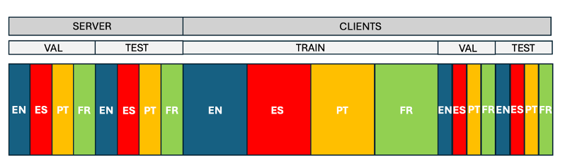
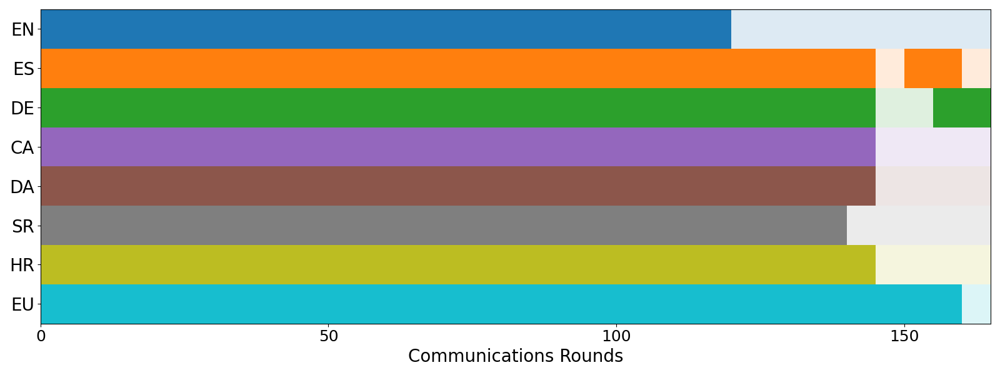
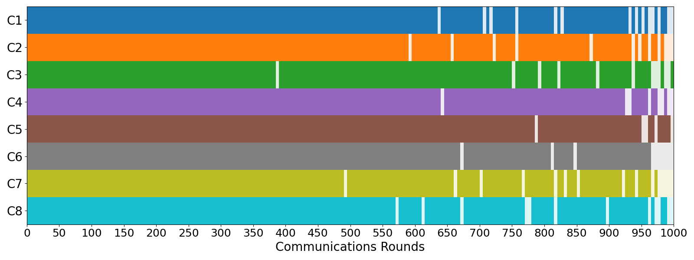

# FedEloquence (LREC2026 submission)

## Overview

This branch contains the experimental code and configurations for our paper: **"Optimizing Multilingual LLMs via Federated Learning: A Study of Client Language Composition"**.

Our contributions extend the FederatedScope repository to support **multilingual federated fine-tuning of Large Language Models (LLMs)**.

> **Note:** For general installation and setup instructions of the repository, please refer to the [README_setup](https://github.com/Telefonica-Scientific-Research/FedEloquence/blob/main/README_setup.md).

---

## Key Features

### 🌍 Multilingual Fine-tuning Support

- **Flexible prompt integration** – Easily add new prompts for different languages
- **Language-aware processing** – Sample-wise preprocessing and fine-tuning based on language tags
- **Comprehensive data pipeline** – Tools for creating multilingual FL partitions including:
  - Server-side validation and test sets
  - Client-side train, validation and test sets
- **Evaluation metrics** – Built-in scripts for computing **BERTScore** and **ROUGE**

### 🎯 Local Dynamic Early Stop for Federated Learning (LDES-FL)

Our novel early stopping mechanism that allows clients to dynamically pause and resume training based on their own validation performance, enabling personalized convergence and adaptive rejoining whenever the global model improves their local validation loss.

**Configuration:**

Set `federate.use_LDES` to `true` and `federate.use_global_early_stop` to `false` in your config file to enable LDES strategy. To use the default early stop method from the original repository, set these variables in the opposite way (`federate.use_LDES` to `false` and `federate.use_global_early_stop` to `true`). Additionally, make sure to specify the patience parameter using `early_stop.patience`. When using LDES, remember that early_stop.patience is applied locally per client, whereas the standard global early stop uses patience on the average validation loss across all clients.

### ✨ Additional Improvements

- Flexible evaluation options against server and/or client test/validation sets
- Enhanced logging and monitoring capabilities
- Optimized data loading for multilingual scenarios

---

## Running Experiments

### Prerequisites

Ensure you have:
- Activated your virtual environment and verified that the repo is functioning correctly. For setup instructions, refer to the [README_setup](https://github.com/Telefonica-Scientific-Research/FedEloquence/blob/main/README_setup.md)
- Configured the `ds_config` file with appropriate training parameters for your hardware (gradient_accumulation_steps, train_micro_batch_size_per_gpu and train_batch_size)
- Downloaded the needed datasets for the experiments and saved them in /data directory:

    You can run the following commands in /FedEloquence to download the multilingual FL dataset and the monolingual datasets.

    Multilingual FL datasets

        huggingface-cli download --repo-type dataset --resume-download aleixsant/alpaca_cleaned_8c_{lang_composition} --local-dir data
    
    >   **Note:** Replace {lang_composition} with the appropriate language composition (mono100_multi0, mono85_multi15, mono70_multi30, mono50_multi50, mono30_multi70, mono15_multi85) for the dataset you want to download. For Local multilingual FT, you can use any of these datasets and set `shuffle_per_client` to `true` (since in Local FT there is only one client, all data will be shuffled).

    Monolingual datasets for Local Monolingual FT

        huggingface-cli download --repo-type dataset --resume-download aleixsant/alpaca_cleaned_{lang_tag} --local-dir data
        
    >   **Note:** Replace {lang_tag} with the appropriate language code for the dataset you want to download.

### Configuration Files

All experimental configurations used in the paper are located in `configs/multilingual/alpaca_cleaned/8c/salamandra-2b-instruct/`:

#### Standard Federated Early Stopping
- `federated/standard/ds_8c_5000r_r16_a32_1pat_160lts_fedavg_mono15_multi85.yaml`
- `federated/standard/ds_8c_5000r_r16_a32_1pat_160lts_fedavg_mono100_multi0.yaml`

#### Local FT
- `local/ds_8c_5000r_r16_a32_5pat_1eval_3b_16320lts_CA.yaml` (Catalan)
- `local/ds_8c_5000r_r16_a32_5pat_1eval_3b_16320lts_DA.yaml` (Danish)
- `local/ds_8c_5000r_r16_a32_5pat_1eval_3b_16320lts_DE.yaml` (German)
- `local/ds_8c_5000r_r16_a32_5pat_1eval_3b_16320lts_EN.yaml` (English)
- `local/ds_8c_5000r_r16_a32_5pat_1eval_3b_16320lts_ES.yaml` (Spanish)
- `local/ds_8c_5000r_r16_a32_5pat_1eval_3b_16320lts_EU.yaml` (Basque)
- `local/ds_8c_5000r_r16_a32_5pat_1eval_3b_16320lts_HR.yaml` (Croatian)
- `local/ds_8c_5000r_r16_a32_5pat_1eval_3b_16320lts_SR.yaml` (Serbian)
- `local/ds_8c_5000r_r16_a32_5pat_1eval_3b_16320lts_multilingual.yaml` (all previous languages)

### Multilingual FL with different client language compositions
- `federated/LDES/ds_8c_5000r_r16_a32_1pat_160lts_fedavg_mono15_multi85.yaml`
- `federated/LDES/ds_8c_5000r_r16_a32_1pat_160lts_fedavg_mono30_multi70.yaml`
- `federated/LDES/ds_8c_5000r_r16_a32_1pat_160lts_fedavg_mono50_multi50.yaml`
- `federated/LDES/ds_8c_5000r_r16_a32_1pat_160lts_fedavg_mono70_multi30.yaml`
- `federated/LDES/ds_8c_5000r_r16_a32_1pat_160lts_fedavg_mono85_multi15.yaml`
- `federated/LDES/ds_8c_5000r_r16_a32_1pat_160lts_fedavg_mono100_multi0.yaml`

### Execution

Run the following command, replacing the config path with your desired experiment configuration:

    deepspeed federatedscope/main.py --cfg configs/multilingual/alpaca_cleaned/8c/salamandra-2b-instruct/federated/LDES/ds_8c_5000r_r16_a32_1pat_160lts_fedavg_mono15_multi85.yaml

Make sure the directory specified by `federate.adapt_save_to`, where the trained adapter will be stored, exists before running the command. Additionally, all the datasets downloaded earlier should be stored in the /data directory.

### Evaluation - Computing BERTScore and ROUGE Metrics

Once you have a trained adapter, evaluate it using the following scripts:

**Available Evaluation Scripts:**
- `get_metrics_server_testset.py` - Server test set
- `get_metrics_server_valset.py` - Server validation set
- `get_metrics_clients_testset.py` - Clients test set
- `get_metrics_clients_valset.py` - Clients validation set

The trained adapter must be stored in the path specified by `federate.adapt_save_to` in your config file.

**Usage:**

Use `--model_to_eval` to specify which model to evaluate:
- `final` - Evaluate the final aggregated model
- `client_X` - Evaluate the best model obtained of a specific client model (e.g., `client_1`, `client_2`)
- `final_LDES`- Evaluate the final aggregated model resulting from the LDES (average of best per-client models)

**Example:**

    python federatedscope/llm/eval/eval_for_alpaca_cleaned/get_metrics_server_testset.py --cfg configs/multilingual/alpaca_cleaned/8c/salamandra-2b-instruct/federated/LDES/ds_8c_5000r_r16_a32_1pat_160lts_fedavg_mono100_multi0.yaml --model_to_eval final_LDES > eval_result/multilingual/alpaca_cleaned/8c/salamandra-2b-instruct/federated/LDES/ds_8c_5000r_r16_a32_1pat_160lts_fedavg_mono100_multi0_server_testset.txt

Results will be saved to the specified output file. Make sure the output directory exists before running the command. You can create the directory for the previous example using the following command:

    mkdir -p eval_result/multilingual/alpaca_cleaned/8c/salamandra-2b-instruct/federated/LDES/
---

## Dataset Creation for Multilingual case where each client has data of a single language (Mono 100%, Multi 0%)

### Multilingual FL Dataset Pipeline

To create the multilingual FL dataset (one client, one language), use:

    create_FL_multilingual_datasets/create_dataset_alpaca_cleaned_8c_mono100_multi0.py

#### Step 1: Configure the Script

The script is parameterized directly in code. Update these fields if needed:
- `langs` (client/language list)
- `length_json`
- `split_train`, `split_val`, `split_test`
- `files` (order of language files used to build partitions)

#### Step 2: Prepare Monolingual Data

Place all language `.jsonl` files in:

    create_FL_multilingual_datasets/alpaca_cleaned/jsonls/

Use `{lang_tag}.jsonl` names (for example: `en.jsonl`, `es.jsonl`, `de.jsonl`, `ca.jsonl`, `da.jsonl`, `sr.jsonl`, `hr.jsonl`, `eu.jsonl`).

#### Step 3: Generate the FL Dataset

Run from the repo root:

    python create_FL_multilingual_datasets/create_dataset_alpaca_cleaned_8c_mono100_multi0.py

Output file:

    data/alpaca_cleaned_8c_mono100_multi0.jsonl

This generated file contains, in order:
- Server validation set
- Server test set
- Clients training sets
- Clients validation sets
- Clients test sets

An example for 4 languages (clients) can be seen below:

When running the training script, FedEloquence will automatically serve the server and the clients with their corresponding partitions. 

The other FL partitions with different client language distributions were derived from this first generated partition (`mono100_multi0`) through a semi-manual curation process. You can find them on Hugging Face.

---

## Visualization Tools

### 📈 Client Training Analysis

Visualize client participation and interaction patterns during LDES-FL training from resulting logs.

#### Available Visualizations

1. **Client Evolution Diagram**
   - Timeline of client activity across training rounds
   - Visual indicators for local early stopping and training resumption events

2. **Client-to-Client Influence Matrix**
   - Heatmap showing inter-client influence
   - Tracks how often each client contributes to another's training resumption

#### Setup & Execution

1. **Prepare your logs:**
   
   Place logs in: `analysis/exp_logs/{dataset}/{n_clients}c/{model}/`
   
   Use log names that include experiment metadata, e.g.:
   `exp_print_8c_pat1_LDES_FedAvg_mono100_multi0.log`

2. **Configure parameters** in `analysis/plot_diagrams.sh`:
   
   Set: `model_name`, `c`, `dataset`, `patience`, `early_stop`, `fl_method`, `client_language_composition`.
   Use `client_language_composition="all"` to process every composition, or a specific one like `mono100_multi0`.

3. **Generate visualizations:**
   
   Run inside `analysis/`: `sh plot_diagrams.sh`

4. **View results:**
   
   Output will be saved in: `analysis/plots/{dataset}/{n_clients}c/{model}/`

See below the Client Evolution Diagrams for the FedAvg with Mono100 - Multi0 and Mono 15 - Multi 85 language composition experiments, respectively:

---

## Configuration Naming Convention

The configuration filenames follow this pattern:

    ds_{clients}_{rounds}_r{rank}_a{alpha}_{patience}pat_{local_training_steps}_{FL_method}_{client_language_composition}.yaml

**Example:** `ds_8c_5000r_r16_a32_1pat_160lts_fedavg_mono100_multi0.yaml`
- `8c` = 8 clients
- `5000r` = 5000 max communication rounds
- `r16` = LoRA rank 16
- `a32` = LoRA alpha 32
- `1pat` = patience 1
- `160lts` = 160 local training steps
- `fedavg` = aggregation method
- `mono100_multi0`= language composition in clients
